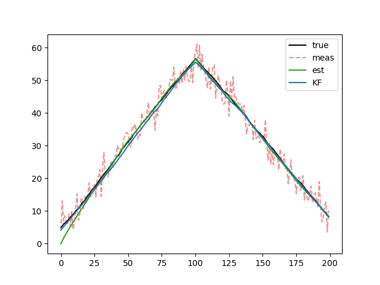

Moving Horizon Estimation
=========================

Consider a state estimation problem using a Moving Horizon Estimator (MHE).
The basic problem consists of finding the state estimate :math:`x_{mhe}` over a horizon :math:`N` the minimizes the sum of squares between the predicted measurements :math:`(y[t] - Cx_{mhe}[t])` and the true measurements as well as the the state estimate and the predicted state :math:`(x_{mhe}[t+1] - (Ax_{mhe}[t]) + Bu[t])` where :math:`A, B, C` are the system matrices, :math:`y` are the prior measurements (including the current), and :math:`u` are the prior controls.
The basic optimization problem is given by:

.. math::

    \min_{x_{mhe}} \quad \sum_{t=0}^{N+1} (y[t] - Cx_{mhe}[t]) + \gamma \sum_{t=0}^{N} (x_{mhe}[t+1] - (Ax_{mhe}[t]) + Bu[t])

where :math:`\gamma` is a weighing parameter that balances the relative importance of the prior model predictions.

The system dynamics, including the noise, are given by:

.. math::
    \begin{align*}
        x[t+1] &= Ax[t] + Bu[t] + \mathbf{w}[t] = f(x[t], u[t], \mathbf{w}[t])\\
        y[t] &= Cx[t] + \mathbf{v}[t]
    \end{align*}

where :math:`\mathbf{w}, \mathbf{v}` are the process and measurement noise.

In addition to the basic problem, we may know some information about the state, such as its bounds :math:`x_{min}, x_{max}`. Consider the following chance constraints on the state estimate that incorporate these bounds:

.. math::
    \begin{align*}
        & \mathbb{P}(f(x_{mhe}[t], u[t], \mathbf{w}[t]) \geq x_{min}) \geq 1-\epsilon \\
        \iff & \mathbb{P}(-f(x_{mhe}[t], u[t], \mathbf{w}[t]) + x_{min} \leq 0) \geq 1-\epsilon \\
        &\mathbb{P}(f(x_{mhe}[t], u[t], \mathbf{w}[t]) \leq x_{max}) \geq 1-\epsilon \\
        \iff & \mathbb{P}(f(x_{mhe}[t], u[t], \mathbf{w}[t]) - x_{max} \leq 0) \geq 1-\epsilon \\
    \end{align*}

Assume that :math:`\mathbf{w}, \mathbf{v}` follow Gaussian distributions with means :math:`\overline{w}, \overline{v}` and variances :math:`\sigma_w^2, \sigma_v^2`: :math:`\mathbf{w} \sim \mathcal{N}(\overline{w}, \sigma^2_w)`, :math:`\mathbf{v} \sim \mathcal{N}(\overline{v}, \sigma^2_v)`.

The chance constraint can be reformulated into a deterministic constraint as follows:

.. math::

    \begin{align*}
    &\mathbb{P}(-f(x_{mhe}[t], u[t], \mathbf{w}[t]) + x_{min} \leq 0) \geq 1-\epsilon \\
    \iff & -f(x_{mhe}[t], u[t], \overline{w}[t]) + x_{min} + \sigma_w \Phi^{-1}(1-\epsilon) \leq 0 \\
    \iff & f(x_{mhe}[t], u[t], \overline{w}[t]) \geq x_{min} + \sigma_w \Phi^{-1}(1-\epsilon) \\
    &\mathbb{P}(f(x_{mhe}[t], u[t], \mathbf{w}[t]) - x_{max} \leq 0) \geq 1-\epsilon \\
    \iff & f(x_{mhe}[t], u[t], \overline{w}[t]) - x_{max} + \sigma_w \Phi^{-1}(1-\epsilon) \leq 0 \\
    \iff & f(x_{mhe}[t], u[t], \overline{w}[t]) \leq x_{max} - \sigma_w \Phi^{-1}(1-\epsilon)
    \end{align*}

where :math:`\Phi^{-1}` is the inverse CDF of the standard normal Gaussian distribution.
However, using cvxRiskOpt, these deterministic reformulation are not necessary and the chance constraint can be encoded directly into the CVXPY problem.

Example
-------

In the following code, we solve the constrained moving horizon estimation problem with CVXPY and cvxRiskOpt.

.. code-block:: python

    import time
    import cvxpy as cp
    import numpy as np
    import matplotlib.pyplot as plt
    from scipy.stats import norm
    from cvxRiskOpt.cclp_risk_opt import cclp_gauss

    def dyn(x, u, w):
        return x + u + w

    def meas(x, v):
        return x + v

    sim_steps = 200
    N_mhe = 10
    w_mean, v_mean = 0, 0
    w_var, v_var = 0.01, 10
    u_min, u_max = -0.5, 0.5
    x_min, x_max = 0, 60
    x0 = 5  # initial state

    x_mhe = cp.Variable(N_mhe + 1, 'x_mhe')
    x_mhe0 = cp.Parameter(name='x_mhe0')
    y_mhe = cp.Parameter(N_mhe + 1, 'y_mhe')
    u_mhe = cp.Parameter(N_mhe, 'u_mhe')
    mhe_obj = 0
    constr = [x_mhe[0] == x_mhe0]
    for t in range(N_mhe + 1):
        mhe_obj += cp.square(y_mhe[t] - meas(x_mhe[t], v_mean))
    for t in range(N_mhe):
        mhe_obj += 100 * cp.square(x_mhe[t + 1] - dyn(x_mhe[t], u_mhe[t], w_mean))
        constr += [cclp_gauss(eps=0.05, a=-1, b=x_min,
                              xi1_hat=dyn(x_mhe[t], u_mhe[t], w_mean),
                              gam11=w_var)]
        constr += [cclp_gauss(eps=0.05, a=1, b=-x_max,
                              xi1_hat=dyn(x_mhe[t], u_mhe[t], w_mean),
                              gam11=w_var)]

    mhe_prob = cp.Problem(cp.Minimize(mhe_obj), constraints=constr)

    # set up the control signal
    u_hist = np.zeros(sim_steps - 1)
    for t in range(sim_steps - 1):
        u_cur = 0.5 if t < sim_steps / 2 else -0.5
        u_cur = np.clip(u_cur, u_min, u_max)
        u_hist[t] = u_cur

    # get all the data
    x_true_hist = np.zeros(sim_steps)
    y_meas_hist = np.zeros(sim_steps)
    for t in range(sim_steps):
        if t == 0:
            x_true_hist[t] = x0
        else:
            w_cur = np.random.normal(loc=w_mean, scale=np.sqrt(w_var))
            x_true_hist[t] = dyn(x_true_hist[t - 1], u_hist[t - 1], w_cur)
        # measure state
        v_cur = np.random.normal(loc=v_mean, scale=np.sqrt(v_var))
        y_meas_hist[t] = meas(x_true_hist[t], v_cur)

    x_est_hist = np.zeros(sim_steps)
    x_kf_est_hist = np.zeros(sim_steps)
    x_kf_est_hist[0] = y_meas_hist[0]
    P, K = 0, 0
    for t in range(1, sim_steps):
        if t >= N_mhe:
            y_mhe.value = y_meas_hist[t - N_mhe:t + 1]
            u_mhe.value = u_hist[t - N_mhe:t]
            x_mhe0.value = x_est_hist[t - N_mhe]
            mhe_prob.solve(solver=cp.CLARABEL)

            print(mhe_prob.status)
            x_est_hist[t - N_mhe + 1:t + 1] = x_mhe.value[1:]

        # # KF gain:
        P_pred = P + w_var
        K = P_pred / (P_pred + v_var)
        P = (1 - K) * P_pred
        x_kf_est_hist[t] = (1 - K) * dyn(x_kf_est_hist[t - 1], u_hist[t - 1], w_mean) + K * y_meas_hist[t - 1]

    plt.plot(range(sim_steps), x_true_hist, color='k')
    plt.plot(range(sim_steps), y_meas_hist, color='tab:red', alpha=0.5, linestyle='--')
    plt.plot(range(sim_steps), x_est_hist, color='tab:green')
    plt.plot(range(sim_steps), x_kf_est_hist, color='tab:blue')
    plt.legend(["true", "meas", "est", "KF"])
    plt.show()

    mean_est_diff = np.mean(np.abs(x_true_hist - x_est_hist)[1:])
    mean_meas_diff = np.mean(np.abs(x_true_hist - y_meas_hist)[1:])
    mean_kf_est_diff = np.mean(np.abs(x_true_hist - x_kf_est_hist)[1:])
    print('MHE diff:', mean_est_diff)
    print('Measurements diff: ', mean_meas_diff)
    print('KF diff: ', mean_kf_est_diff)

.. parsed-literal::

    MHE diff: 0.5968899812607984
    Measurements diff:  2.2559395317797053
    KF diff:  0.6506733772967995

If the Guassian assumption about the noise were to change, updating the chance constraint can easily be done by changing the `cclp_gauss` call to call another `cclp_risk_opt` function.
